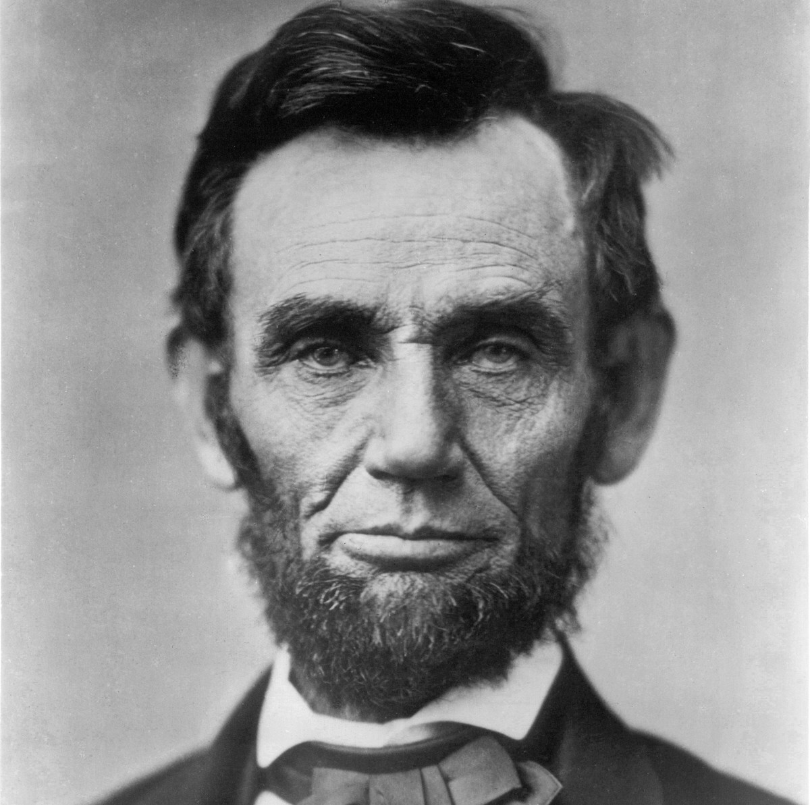
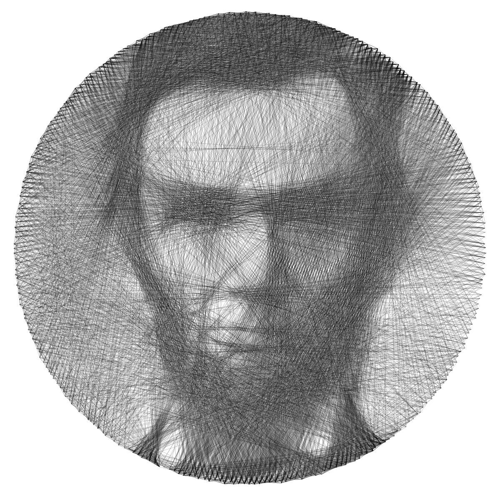
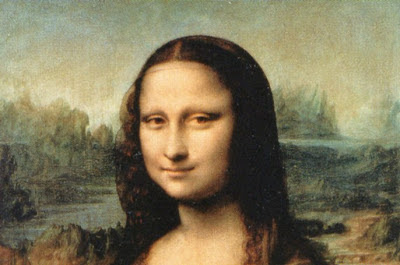
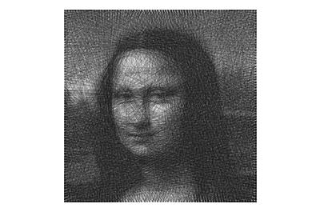
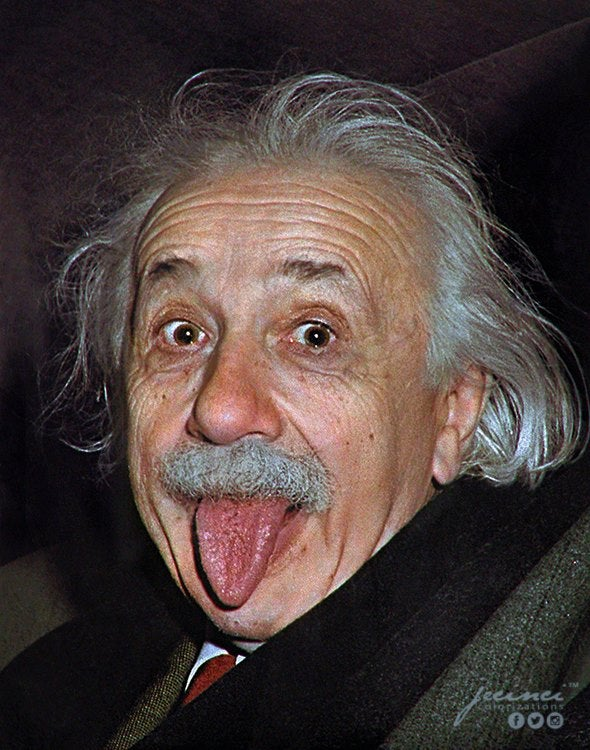
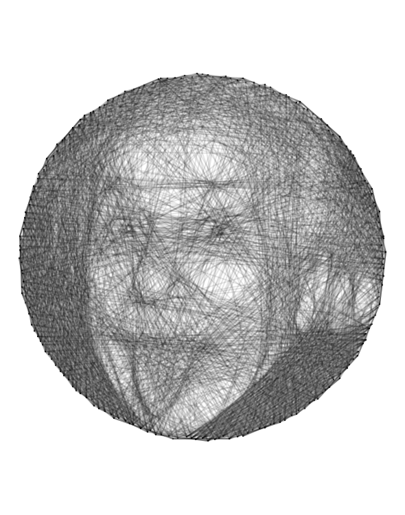

# Examples

This folder contains some examples of the images produced by this program and the commands used to generate them.

## Lincoln

```sh
stringart lincoln.jpg lincoln_out.jpg -o 0.2 -l 0.3 -j 3
```




## Mona Lisa

```sh
stringart mona_lisa.jpg mona_lisa_out.jpg -o 0.1 -l 0.15 -S square
```




## Einstein

```sh
stringart einstein.jpg einstein_out.svg -w 2 -o 0.1 -l 0.1 -j 3 -i 2000 -n 200
```



