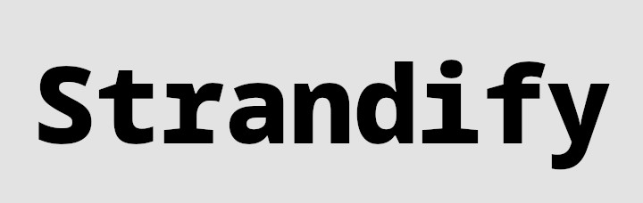
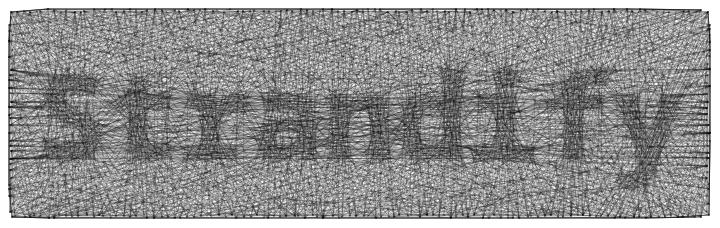
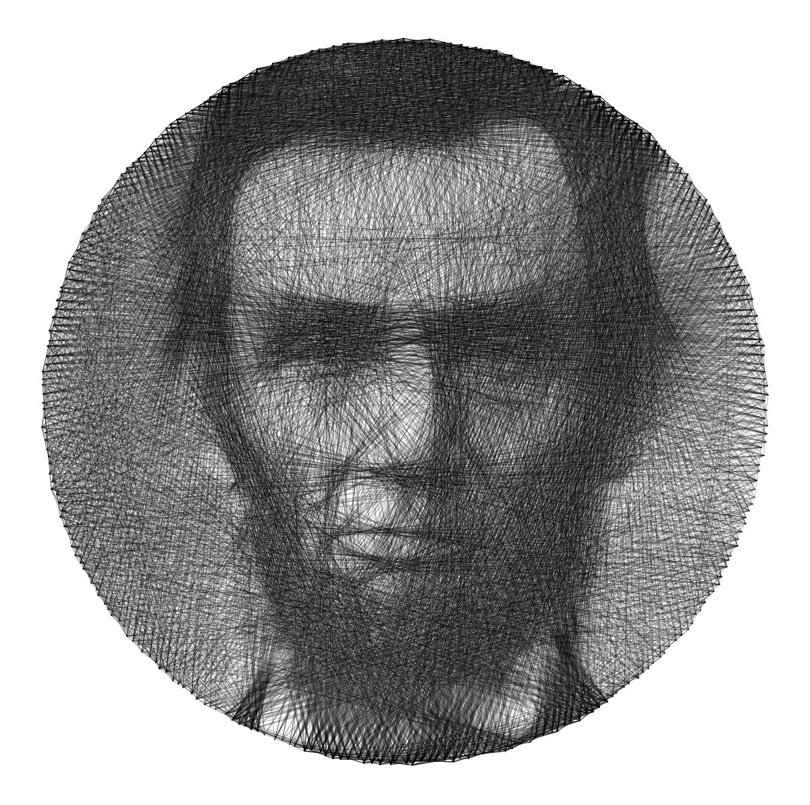
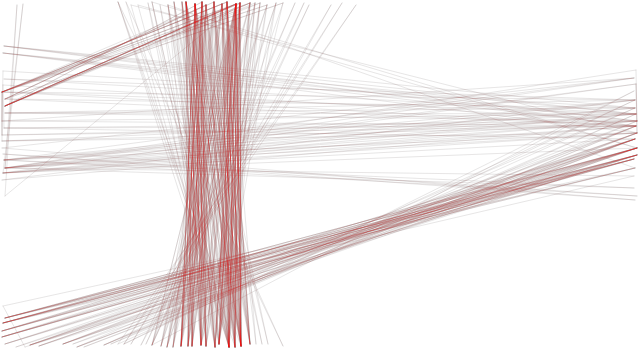

# Examples

This folder contains some examples of the images produced by this program and the commands used to generate them.

## Strandify

```sh
strandify strandify.jpg strandify_out.jpg -S border -o 0.2 -j 2 -l 0.3 -i 2000
```




## Lincoln

```sh
strandify lincoln.jpg lincoln_out.jpg -o 0.3 -l 0.2 -j 3
```




## Mona Lisa

```sh
strandify mona_lisa.jpg mona_lisa_out.jpg -S square -o 0.1
```


## Einstein

```sh
strandify einstein.jpg einstein_out.svg -w 2 -o 0.1 -l 0.2 -j 3 -i 2000 -n 200
```


## Golden Gate Bridge

```sh
strandify golden_gate.jpeg golden_gate_out_red.png -S border -j 2 -C "255 0 0" --project-to-yarn-color -m 0.01 -t -o 0.1 -i 500
strandify golden_gate.jpeg golden_gate_out.jpg -S border -j 2 -m 0.01 -o 0.08 -l 0.1
magick composite golden_gate_out_red.png golden_gate_out.jpg golden_gate_composite_out.png
```




